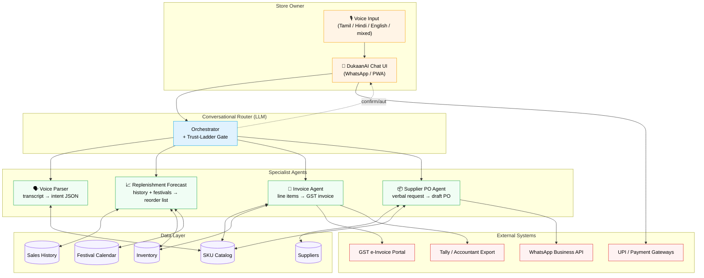
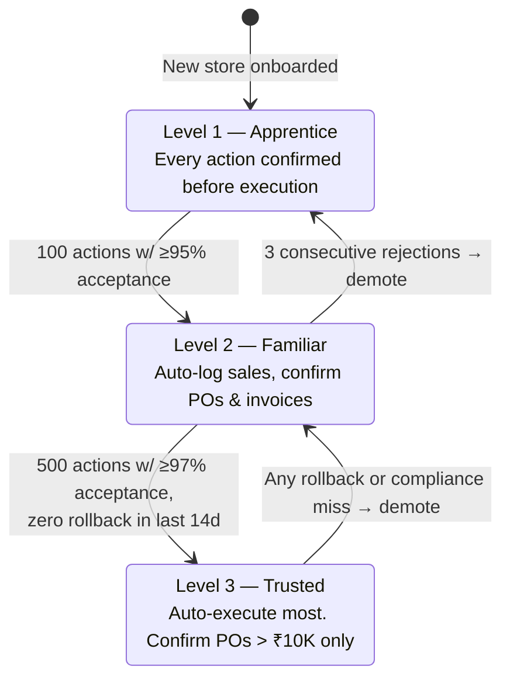

# Solution Architecture

## High-level system

## Why a multi-agent design instead of one monolithic prompt

| Concern | Monolithic prompt | Specialist agents |
|---|---|---|
| **Prompt regression risk** | Any tweak risks all flows | Isolated — invoice fix doesn't touch voice parsing |
| **Eval & accuracy tracking** | Single blended metric | Per-agent gold sets + per-agent KPIs (K1 voice-intent, K3 invoice latency) |
| **Latency budget** | One giant context every turn | Router calls only the agents needed; each agent runs with a tight context |
| **Cost** | Pays for max context every call | Cheaper models per agent where appropriate |
| **Team scaling** | One PM owns everything | Agents become product surfaces with clear ownership |

This mirrors the pattern shipped in Feature Gate (Anthropic-internal multi-agent system) and ChatFactory (the agent we shipped at PathFactory) — proven cleaner to operate than monolithic prompts.

## Trust Ladder (autonomy progression)

Demotion is silent — the owner just sees more confirmations. This is the core mechanism that keeps the system honest with low-trust users.
