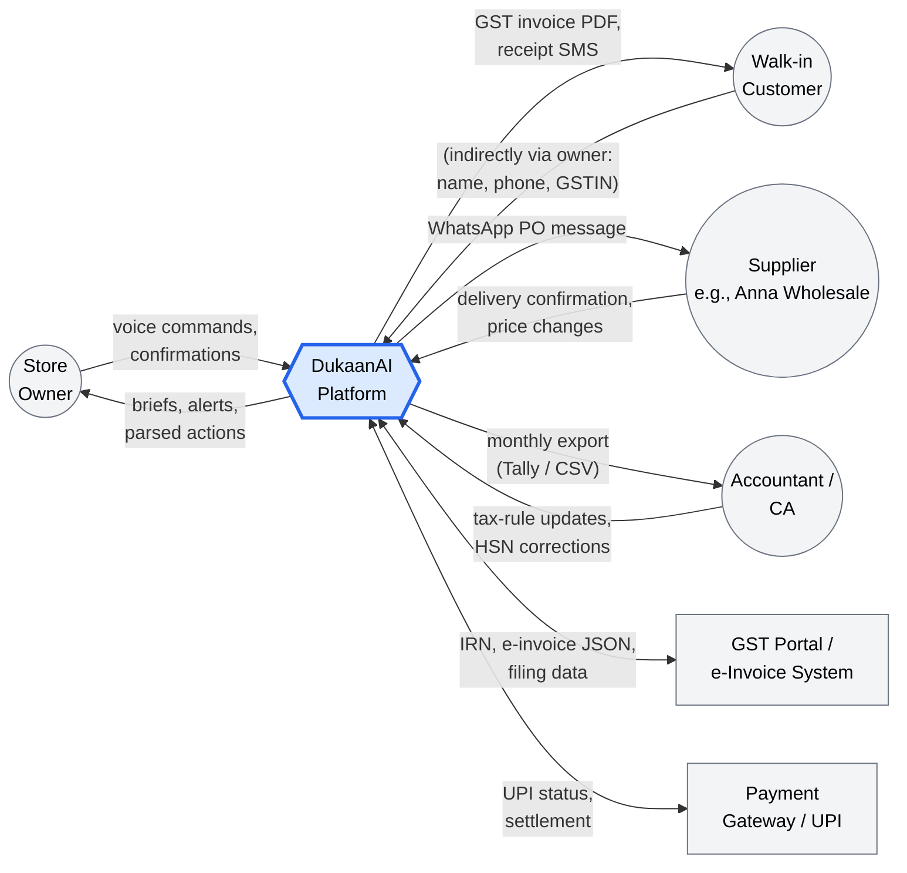
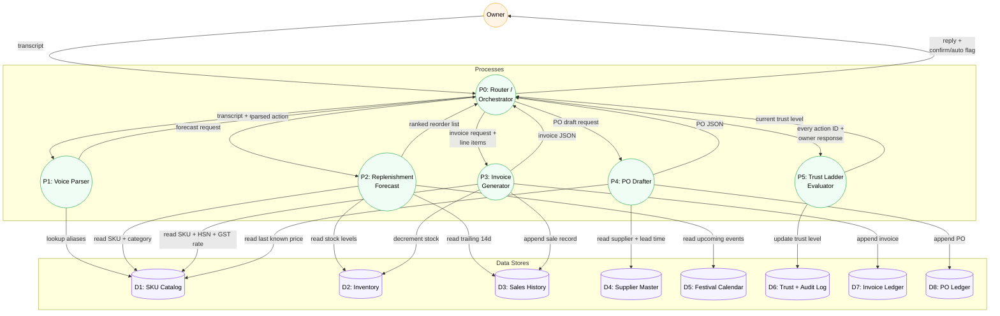

# Data Flow Diagrams

## Level 0 — Context Diagram

The system seen from the outside. Who/what touches DukaanAI and what data crosses each boundary.

---

## Level 1 — Internal data flows

Zoom into the platform. Numbered processes (P1–P5) match the five agents.

---

## Data dictionary (selected stores)

| Store | Key fields | Update frequency | Retention |
|---|---|---|---|
| **D1 SKU Catalog** | sku_id, name, aliases[], HSN, GST%, MRP, selling_price, category | Weekly (price corrections); Daily (new SKUs during onboarding) | Forever |
| **D2 Inventory** | sku_id, on_hand_qty, last_movement_ts | Every sale, every PO receipt | Forever (snapshots daily) |
| **D3 Sales History** | sale_id, ts, items[], payment_mode, total, invoice_id | Every confirmed sale | 7 years (GST audit) |
| **D5 Festival Calendar** | date, festival_name, applicable_states[], category_multipliers{} | Yearly refresh + manual edits | Forever |
| **D6 Trust + Audit Log** | action_id, owner_id, agent, accepted/rejected, ts | Every owner-facing action | 2 years rolling |

---

## Privacy & data residency

- All data stored in **AWS Mumbai (ap-south-1)** — required for India retail data under DPDP Act 2023.
- Voice transcripts are stored hashed (SHA-256) for eval purposes; raw audio is **not retained** beyond the 5-second transcription window.
- Customer PII (phone, name, GSTIN) only stored if the owner explicitly tags a credit sale or a B2B invoice. Walk-in cash sales are anonymous by default.
- Owner can export everything as CSV and request deletion within 30 days (DPDP "right to erasure").
