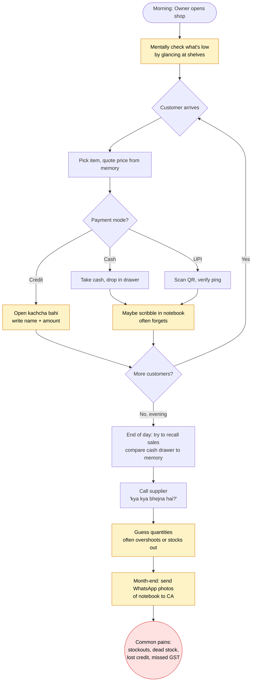
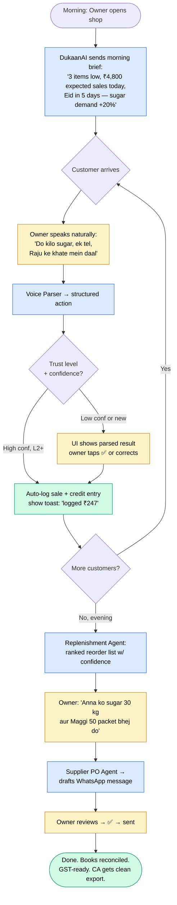

# Process Flow — Before vs After

## Current State: A typical day at a kirana store

**Average failure surface:** ~12 manual handoffs per customer-day, each with a forgetfulness/error rate of 5-15%.

---

## Future State: Same day with DukaanAI

**New failure surface:** ~3 confirmation taps per customer-day (L2 trust), zero for credit/sales reconciliation. Forgetfulness offloaded to the agent.

---

## Quantitative delta (target by end of pilot)

| Metric | Before | After (target) | Source |
|---|---|---|---|
| Time per sale logged | 30-60s (or never) | < 5s | Internal logs |
| Stockouts per week | 8-12 SKUs | 4-6 SKUs (−50%) | Inventory snapshots |
| Time to draft a PO | 15-30 min | < 2 min | Owner stopwatch study |
| Time to monthly GST close | 4-6 hrs at CA | < 1 hr (clean export) | CA invoice |
| Credit ledger leakage | 5-10% never recovered | < 1% | Outstanding-vs-collected |
